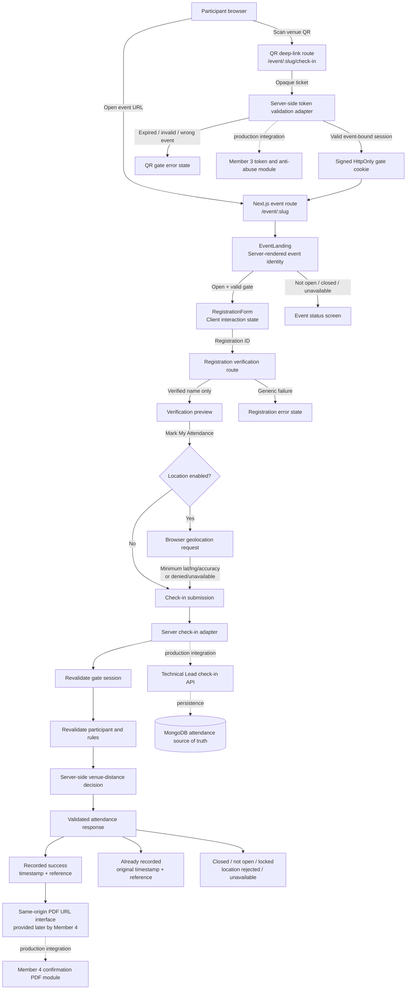

# AWS SBG Event Attendance Platform

Participant-facing event attendance experience for the AWS Student Builder Group at Sathyabama Institute of Science and Technology.

| Project detail | Value |
| --- | --- |
| Module owner | Member 2 - Check-in Frontend & Event Experience |
| Author | **goprocker** |
| Development branch | **`feature/member-2-checkin`** |
| Repository | `https://github.com/aws-sbg-sist/attendance.git` |
| Application | Next.js 16 / React 19 |
| Status | Local fixture implementation ready for Technical Lead integration |

## What I built

Member 2's work covers the complete participant-facing check-in journey described in the team workflow:

1. Display the selected event and its attendance status.
2. Require the participant to enter through a valid event-specific QR/deep link.
3. Verify the registration ID on the server before revealing the participant name.
4. Show a final participant and event preview.
5. Request browser location only at the final attendance step when location checking is enabled.
6. Send the minimum location data to the server for the venue decision.
7. Wait for the server to confirm attendance before displaying success.
8. Present success, duplicate, timing, location, lock and service-failure states.
9. Expose the confirmation-PDF button only when Member 4's integration supplies a safe same-origin URL.

The implementation also includes a responsive premium dark interface, keyboard-accessible forms, loading states, server-response validation, development fixtures and reproducible tests.

## Pages and routes

### User-facing pages

| Route | Purpose | States demonstrated |
| --- | --- | --- |
| `/` | Lightweight platform homepage and local readiness screen | Platform available |
| `/event/aws-cloud-workshop` | Open-event landing page | QR required or registration form when a valid gate cookie exists |
| `/event/aws-cloud-workshop/check-in?ticket=live-aws-token` | Local QR/deep-link entry | Validates the event token, stores the gate session and redirects to the clean event URL |
| `/event/upcoming-event` | Event before its attendance window | Attendance not open |
| `/event/closed-event` | Event after its attendance window | Attendance closed |
| `/event/unknown-event` | Unknown event slug | Event unavailable |

### Development-only server routes

| Route | Method | Responsibility |
| --- | --- | --- |
| `/api/dev/events/:slug/registration/verify` | `POST` | Validate an event-bound registration ID and return the participant name only after success |
| `/api/dev/events/:slug/check-in` | `POST` | Revalidate the gate and participant, evaluate the location result and return the authoritative fixture outcome |

Both `/api/dev/...` routes return `404` when `NODE_ENV=production`. They are integration adapters, not a production attendance backend.

## Architecture



### Runtime boundary

```text
Browser
  └─ Event page and RegistrationForm
       ├─ never receives the participant list
       ├─ never validates QR signatures
       ├─ never calculates the trusted venue result
       └─ never decides that attendance succeeded

Next.js server
  ├─ validates the event gate cookie
  ├─ validates request size and shape
  ├─ verifies the registration through a server-only adapter
  ├─ calculates fixture venue distance server-side
  └─ returns a validated attendance outcome

Production integration still required
  ├─ Member 3: rotating tokens, replay protection and abuse controls
  ├─ Technical Lead: real API, database, atomic uniqueness and authorization
  └─ Member 4: confirmation payload and browser-generated PDF receipt
```

## Participant state model

| State | Participant experience |
| --- | --- |
| Open | Event identity and the available check-in step are shown immediately |
| Not open | Opening time is displayed; attendance cannot be submitted |
| Closed | Closing time is displayed; attendance cannot be submitted |
| Missing QR gate | Participant is told to scan the currently displayed venue code |
| Expired QR | Participant is instructed to scan the current code |
| Invalid/wrong-event QR | Generic event-code failure without cross-event details |
| ID entry | Labelled registration field, instructions and associated error region |
| Verifying | Input and action are disabled while the server responds |
| Invalid registration | Generic failure that does not reveal cross-event membership |
| Verification preview | Verified participant name, registration ID and event details |
| Locating | Location is requested only after `Mark My Attendance` |
| Submitting | Repeated button presses are blocked while the server decides |
| Recorded | Server timestamp and attendance reference are displayed |
| Already recorded | Original timestamp/reference are displayed without a second check-in action |
| Temporary lock | Retry period and recovery direction are displayed |
| Location rejected | Denied, unavailable and outside-venue cases receive specific recovery guidance |
| Service unavailable | Retry and event-team contact guidance are displayed |

## Component map

| File | Role |
| --- | --- |
| `apps/web/app/event/[slug]/page.tsx` | Resolves the event and signed gate state on the server |
| `apps/web/app/event/[slug]/check-in/route.ts` | Accepts the QR ticket, creates the gate cookie and redirects |
| `apps/web/app/event/[slug]/loading.tsx` | Route-level loading skeleton |
| `modules/checkin-experience/src/event-landing.tsx` | Event identity, timing states and QR gate presentation |
| `modules/checkin-experience/src/registration-form.tsx` | Registration, preview, location, submission and result UI |
| `modules/checkin-experience/src/attendance-result.mjs` | Validates server attendance responses before rendering success |
| `modules/checkin-experience/src/fixture-events.ts` | Development event records matching the expected event shape |
| `modules/checkin-experience/src/server/fixtures.mjs` | Server-only registration and attendance fixture adapter |
| `apps/web/lib/gate-session.mjs` | Signed event-bound gate session creation and validation |
| `apps/web/lib/check-in-request.mjs` | Check-in request and location-shape validation |

## Expected integration contracts

### Public event

The UI expects public event data containing:

```text
id, slug, name, venue, venueLat, venueLng, venueRadiusM,
date, startsAt, attendanceOpensAt, attendanceClosesAt,
posterUrl, brochureUrl, status
```

### Registration verification

The server-only verification step must return either a verified participant name or one generic failure. Registration IDs remain strings so leading zeroes are preserved.

### Check-in result

The client accepts only these validated outcome families:

- `recorded`
- `already-recorded`
- `locked`
- `location-rejected`
- `closed`
- `not-open`
- `invalid`
- `unavailable`

A recorded or duplicate response contains the verified participant name, registration ID, server-generated `checkedInAt`, attendance reference and optional `confirmationPdfUrl`. PDF URLs must be same-origin relative paths.

## Security design

An independent branch security review found no actionable vulnerabilities in the implemented Member 2 development surface.

Verified controls:

- HMAC-signed gate sessions with constant-time signature comparison.
- Gate sessions bound to the selected event slug and expiration time.
- `HttpOnly` and `SameSite=Strict` cookies; `Secure` is enabled in production.
- Raw QR tickets are removed from the browser URL after server validation.
- Registration and check-in POST requests require a valid event gate.
- Registration IDs are trimmed, length-limited and treated as strings.
- Request sizes and JSON content types are restricted.
- Latitude, longitude and accuracy values are validated server-side.
- Venue distance is calculated on the server; no client-provided `insideVenue` value is trusted.
- Participant fixture records remain in server-imported modules and were not found in event-page client bundles.
- Attendance responses are validated before the UI claims success.
- Confirmation PDF links are restricted to same-origin relative paths.
- No unsafe HTML injection, dynamic code evaluation or command-execution sink is used.
- Security headers include Content Security Policy, `no-referrer`, `nosniff`, frame denial, Permissions Policy and Cross-Origin Opener Policy.
- Fixture validation routes and fixture data are disabled in production.

### Production security dependencies

The following are intentionally not claimed as completed by Member 2:

- Real rotating token generation and verification.
- Replay/nonce protection and refresh overlap handling.
- Persistent rate limiting, temporary lock tracking and abuse logging.
- Production participant authorization and registration storage.
- Atomic database uniqueness for one attendance record per participant/event.
- Persistent attendance and audit records.
- Admin authentication and authorization.
- Production confirmation PDF generation.

These belong to Member 3, Member 4 and the Technical Lead. The local fixtures demonstrate UI contracts only. Dependency-advisory status was not independently confirmed because the npm audit service was unavailable during the review.

## Visual design and accessibility

The interface uses a premium developer-tool direction inspired by the restraint and density of Linear, Vercel and Raycast without copying their branding or layouts.

- Graphite page and elevated surfaces.
- Thin structural dividers and restrained shadows.
- AWS orange reserved for the main attendance action.
- System sans-serif typography with monospace operational metadata.
- Compact event rail on desktop and task-first content ordering on mobile.
- Semantic headings, forms, definition lists and status regions.
- Explicit labels and errors associated with the registration field.
- Visible keyboard focus and programmatic focus after asynchronous state transitions.
- Touch-friendly controls and reduced-motion fallbacks.
- No large videos, animation frameworks, participant datasets, dashboards or PDF libraries in the participant route.

Rendered checks were completed at approximately 1440x900, 1024x900, 768x1024 and 390x844. The final inspected page had no horizontal overflow or active framework error overlay.

## Local development

### Requirements

- Node.js 20.9 or newer
- npm 10 or newer

### Install and run

```bash
npm install
npm run dev
```

Open `http://localhost:3000` or use the local QR fixture:

```text
http://localhost:3000/event/aws-cloud-workshop/check-in?ticket=live-aws-token
```

### Portable commands

```bash
npm run dev
npm run build
npm test
```

All project commands use npm workspaces and repository-relative paths. No user directory, bundled runtime or machine-specific configuration is required.

## Development fixtures

### Registration IDs

| ID | Result |
| --- | --- |
| `AWS001` | Successful attendance fixture |
| `00125` | Already-recorded fixture with leading zeroes |
| `SLOW001` | Slow verification/submission fixture |
| `ERROR001` | Registration verification service failure |
| `LOCK001` | Temporary lock result |
| `RETRY001` | Check-in service unavailable result |
| `CLOSED001` | Server reports attendance closed |
| `WAIT001` | Server reports attendance not open |
| Any other ID | Generic registration failure |

### QR tickets

| Ticket | Result |
| --- | --- |
| `live-aws-token` | Valid token for the workshop fixture |
| `expired-aws-token` | Expired token |
| `tampered-token` | Unknown/tampered token |
| `live-other-event` | Token belongs to another event |

All values above are intentionally fake development data. They are not credentials and are unavailable through the fixture endpoints in production mode.

## Testing

The repository currently contains 32 reproducible Node test cases covering:

- Required repository structure and portable scripts.
- Valid, expired, tampered and wrong-event QR gates.
- Signed gate creation, event binding and tamper rejection.
- Valid, invalid, wrong-event, leading-zero and unavailable registration results.
- Granted, denied, unavailable and malformed location payloads.
- Recorded, duplicate, lock, timing, location and unavailable attendance outcomes.
- Twelve accepted/rejected UI result contract cases.
- Unsafe confirmation URL and malformed server timestamp rejection.

Run:

```bash
npm test
npm run build
```

At the latest documented check, all 32 tests passed and the Next.js production build completed successfully.

## Repository structure

```text
attendance/
├─ apps/
│  ├─ web/                       Next.js participant application
│  └─ api/                       Technical Lead API boundary
├─ modules/
│  ├─ participant-import/        Member 1 boundary
│  ├─ checkin-experience/        Member 2 implementation
│  ├─ token-security/            Member 3 boundary
│  └─ attendance-admin/          Member 4 boundary
├─ packages/
│  ├─ ui/                        Shared UI boundary
│  ├─ contracts/                 Shared contract boundary
│  └─ validation/                Shared validation boundary
├─ docs/                         Shared documentation
├─ fixtures/                     Safe fixture boundary
├─ tests/                        Reproducible module tests
├─ .env.example                  Placeholder environment names only
└─ README.md
```

## Known limitations and handoff requirements

- The development adapter does not persist attendance and therefore is not the source of truth.
- The duplicate result is a deterministic fixture, not proof of database-level atomic uniqueness.
- The real public event, participant, token and attendance services are not yet connected.
- The current PDF button remains unavailable until Member 4 returns a verified confirmation URL.
- Production secrets, database configuration and admin authorization are intentionally absent.
- A full 100-participant concurrency simulation requires the integrated backend and database.
Before production deployment, the Technical Lead must replace development adapters, connect MongoDB, enforce unique attendance records atomically, integrate Member 3 security controls, integrate Member 4 PDF generation, rerun security/dependency audits and complete the full event simulation.

## Git workflow

All Member 2 changes belong on:

```text
feature/member-2-checkin
```

Do not commit directly to `main`. The Technical Lead reviews the feature branch and performs release integration. A pull request should include scope, test results, desktop/mobile screenshots, contract changes, known limitations and security-review notes.
